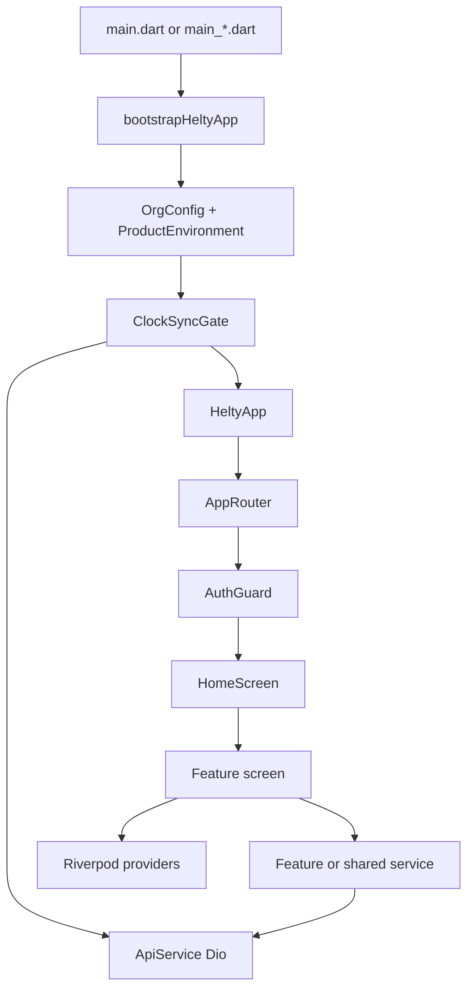

# Architecture

Helty is a single-process Flutter client. Screens call services. Services call one shared Dio client. Riverpod holds session and screen data. AutoRoute decides which screen is visible. The product definition decides which of those screens exist.

## Layers

### 1. Product configuration

`ProductDefinition` is data: a name and a set of modules. `ProductEnvironment` is the process-wide reader. `ProductModuleAccess` (`lib/src/app/product_module_access.dart`) answers two practical questions:

- Which `accountType` strings belong to which `AppModule`?
- If this person’s natural home screen is disabled, which dashboard should open instead?

`fallbackInitialRoute` walks registration, then billing, then pharmacy, then laboratory, then radiology, and otherwise opens the front desk dashboard.

`allowedDepartmentTypes` is the staff-create dropdown for the current product. `super_admin` is always included. `allowedHubDepartments` filters the super-admin hub tiles the same way.

### 2. Navigation

`AppRouter` in `lib/app_router.dart` has two parts:

- `sharedAuthRoutes()` — login, register, forgot password, reset password. No guard. Login is the initial route.
- `HomeRoute` with `AuthGuard`, whose children come from `ProductRoutes.homeChildren()`.

`HomeScreen` (`lib/src/ui/home/home_screen.dart`) is the authenticated shell. It does not use a tab bar for departments. The sidebar (or a drawer when the window is narrower than 720 px) lists `MenuItem`s, and the page body is `AutoRouter()`, which shows the child route.

The shell’s 720 px drawer breakpoint is local to `HomeScreen`. Feature pages use `AppBreakpoints` from `lib/src/core/responsive.dart` (mobile under 600, desktop from 1100).

### 3. Feature modules

A feature folder owns its screens. It may own a service (`PharmacyApiService`, `LabApiService`, `AccountsReportsService`) or it may call a shared service in `lib/src/services/` (`EncounterService`, `InvoiceService`, `PatientService`).

There is no strict “domain / data / presentation” package split. The convention is:

- screen widgets live next to the feature
- HTTP lives in a `*Service` class
- Riverpod `Provider`s either live in `lib/src/providers/` (shared) or in the feature’s `providers/` folder
- permission checks live in `lib/src/auth/` or in a feature `auth/` file such as `pharmacy/auth/pharmacy_permissions.dart`

### 4. HTTP

`ApiService` is a factory singleton. Its `Dio` instance is created once with:

| Setting | Value |
|---|---|
| Initial base URL | First candidate from `ProductEnvironment` |
| Timeouts | 15 seconds connect, receive, and send |
| Headers | `Content-Type` and `Accept` are `application/json` |

Interceptor order:

1. `AuthInterceptor` — sets `Authorization: Bearer <access token>`
2. `RefreshTokenInterceptor` — on 401, `POST /auth/refresh`, retries the original request once
3. `ErrorInterceptor` — maps `DioException` to `AppException`
4. `LogInterceptor` — debug builds only
5. `DecimalNormalizeInterceptor` — turns Prisma decimal objects `{s, e, d}` into plain numbers

`setBaseUrl` replaces the origin after the clock-sync race. Feature services should read `ApiService().dio` (or accept an injected `Dio`, which accounts, chat, and tickets do) so they pick up that origin.

### 5. State

Riverpod 3 (`flutter_riverpod`) is the state layer. The root is the `ProviderScope` in `bootstrapHeltyApp`.

Older notifiers use `StateNotifier` from `flutter_riverpod/legacy.dart` (`AuthNotifier`, theme, billing lists, super-admin preview). Newer code uses `Notifier` (`appLifecycleProvider`).

`provider` is listed in `pubspec.yaml` and is not used as `package:provider` anywhere in the app. New state belongs in Riverpod.

Widgets are `ConsumerWidget` or `ConsumerStatefulWidget`. They `ref.watch` what should rebuild the screen and `ref.read` for one-shot actions such as submit.

### 6. Persistence on the device

| Store | Contents |
|---|---|
| `flutter_secure_storage` | `access_token`, `refresh_token`. Android uses encrypted shared preferences. A read that fails on Windows DPAPI returns null and does not crash startup |
| `SharedPreferences` | Theme mode, PDF template id, up to five recent login identifiers, dismissed announcement ids |
| Memory | Parked billing sessions, super-admin “view as” preview, in-progress filters |

Clinical and financial records are not cached as a local database. If the API is down, lists fail and the screen shows the error from `userFacingErrorMessage`.

## How one action travels

Example: a doctor completes an encounter.

1. `DoctorEncounterViewScreen` holds `encounterId` from the route.
2. The complete button calls `EncounterService.complete`.
3. `EncounterService` does `PATCH /encounters/:id/complete` on `ApiService().dio`.
4. `AuthInterceptor` attaches the bearer token.
5. The JSON body comes back through the decimal normalizer.
6. The screen updates local state or invalidates the encounter provider and pops or refreshes the chart.

Example: a product hides theatre.

1. `kPharmacyProduct.enabledModules` does not contain `AppModule.theatre`.
2. `ProductRoutes.homeChildren` skips `hospitalOnlyRoutes`, so theatre routes are not registered.
3. `moduleForRouteName('TheatreDashboardRoute')` returns `AppModule.theatre`.
4. `ProductModuleGuard` rejects a navigation that still names that route.
5. `HomeScreen._menuForRole` also checks `ProductModuleAccess.isModuleEnabled` before adding the theatre menu.

Both the router and the menu must agree. Omitting the route is the real filter. The guard is the backup.

## Generated code

AutoRoute screens are marked `@RoutePage()`. The class `FooScreen` becomes route name `FooRoute` because `AppRouter` sets `replaceInRouteName: 'Screen|Page,Route'`. Nested tabs use the same annotation and appear as children in the route group files.

Freezed and `json_serializable` generate `*.freezed.dart` and `*.g.dart`. The invoice model is the main Freezed type. Most other models are hand-written `fromJson` constructors.

## Errors the UI should show

`lib/src/core/errors/app_exception.dart` defines `NetworkException`, `TimeoutException`, `ServerException`, `ValidationException`, `UnauthorizedException`, and the base `AppException`. `userFacingErrorMessage` turns those into a sentence for a snackbar or an empty state. Screens should use that helper rather than showing a raw `DioException`.

## Time

Business dates are interpreted in `Africa/Lagos` after `AppTimezone.initialize()`. The clock-sync gate refuses to run the clinical app when the PC clock is more than two minutes away from `GET /server-time`, because medication schedules and payment timestamps depend on that clock.

## What this architecture deliberately does

- One repository, several entry points, one router that is filtered by product.
- One Dio client, many small service classes.
- Department menus derived from `accountType` and `staffRole`, with a second filter from `AppModule`.
- Shared clinical widgets (`HeltySurfaceCard`, responsive tables) so a new screen matches the walk-in queue instead of inventing another visual language. That look is specified in [UI conventions](08-ui-conventions.md).
