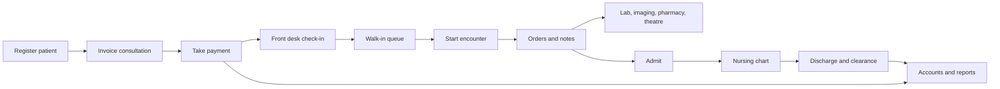

# Patient journey

This is the path a person takes through the hospital product, and the code that implements each step. Smaller products use the prefix of this path that their modules include (registration and billing always, then pharmacy and/or laboratory and radiology).

## 1. Register the patient

`PatientListScreen`, `PatientFormScreen`, and `NewPatientScreen` live in `lib/src/paitients/`. `PatientService` talks to `/patients`. It can list who registered today, search similar matches, merge duplicates (`MergePatientsDialog`), and create a no-ID patient when the person cannot produce an identifier.

`LinkOneTimePatientScreen` later attaches a temporary registration to a full record. That route is hospital-only.

The patient model (`Patient`) is the master record every other module searches. Allergies are edited with `patient_allergy_editor.dart`.

## 2. Create the consultation charge

Billing sells a consultation from the service catalog (`ServiceService`, `/services`). The catalog is maintained in `hospital_service/` (`SystemSetupScreen`) and in the older screens under `lib/src/ui/patinets_services/`.

`InvoiceService` creates and updates invoices on `/invoices`. An invoice is the bill of record: lines, HMO or discount coverage, wallet movements, and payments all attach to it.

`EnlistPaitientScreen` (`lib/src/enlist_services/`) is the step that picks the patient (or a no-ID walk-in) before that invoice or before a module request. `moduleRequestFlowProvider` records whether the flow continues into billing, laboratory, radiology, dialysis, or HMO. `parkedBillingProvider` holds a cashier session that was set aside.

Clinical packages (`ClinicalPackageService`, `/clinical-packages`) apply a bundle of catalog services and drugs in one action, including a default antenatal package.

## 3. Take payment

`PendingBillsScreen` is the cashier worklist. `PayBill` posts the payment. `TransactionsScreen` is the ledger: list, filter, quick pay, change tender, refund, reprint.

`TransactionService` uses `/invoices/payments` and `/invoices/payments/quick`. Banks come from `/banks` (`BankService`, `BankManagementScreen`).

Receipts are printed locally by `lib/src/printing/escpos/`. The payment row is a `TransactionModel`.

A paid consultation that does not yet have an encounter is the credit the doctor’s queue looks for. The model is `paid_without_encounter_invoice.dart`, loaded with `GET /invoices/paid-without-encounter?patientId=`. The chip on screen is `consultation_credit_chip.dart`.

`PatientWalletHistoryScreen` is the prepaid balance: deposit, adjust, and a local receipt. Wallet HTTP is on `InvoiceService` under `/invoices/wallets/{patientId}`.

## 4. Check in at the front desk

`FrontDeskDashboardScreen` (`lib/src/frontdesk/dashboard.dart`) summarizes the desk. `FrontdeskDashboardService` loads that summary.

`CheckInPatientDialog` finds the paid invoice without an encounter and checks the patient in through `WaitingPatientService` (`/waiting-patients`). Check-in does not create the encounter. It places the person on the queue the doctor will open.

Appointments are a parallel door: `AppointmentListScreen`, `NewAppointmentScreen`, and `AppointmentRequestsScreen` (portal requests waiting for records or the desk). `AppointmentService` uses `/appointments`.

`PatientDevicesScreen`, `PendingDeviceApprovalsScreen`, and `FamilyLinksScreen` manage the patient mobile app’s devices and family accounts. `PatientAccessService` is the client. Those approval screens are on the hospital product.

## 5. The doctor opens the chart

`DoctorWalkInQueueScreen` and `DoctorWaitingPatientsScreen` list who is waiting. `StartEncounterDialog` checks the consultation credit. Confirming calls `EncounterService.startOutpatient` (`POST /encounters/outpatient/start`) with the patient, the doctor, and `visitType: 'Walk-in'` on the walk-in path. If the row already has an encounter id, the screen opens that encounter instead of starting another.

`DoctorEncounterViewScreen` loads the patient and `EncounterService.getById`. The first open can show `EncounterSpecialtyGate` so the doctor attaches specialty questionnaires or skips them. `EncounterScope` is an inherited widget that tabs read for ids, amend mode, and emergency flags.

Ongoing tabs, in order, and what each one writes:

| Tab | Saves |
|---|---|
| Chart | Navigation only |
| History | `PATCH /encounters/:id` — complaint, HPI, past history, drugs, allergies, family, social |
| Examination | `examinationNotes` |
| Diagnosis | `POST /encounters/:id/diagnoses` — primary ICD and secondary JSON |
| Investigations | `LabOrderService.create` |
| Imaging | `RadiologyService.createOrder` with `encounterId` |
| Surgery | `TheatreApiService.createSurgeryRequest` |
| Prescription | `MedicationOrderService.create` against the drug catalog |
| Procedures | `proceduresJson` on the encounter. Consumables can be added to an open invoice |
| Notes | SOAP fields. Locking sets `soapLockedAt` |
| Admission | `AdmissionService.create`, or `EmergencyService.admitFromEd` when the visit is from the ED |
| Follow-up | `EncounterService.saveFollowUp`, which creates or updates an `Appointment` |

Complete is `PATCH /encounters/:id/complete`. Amend mode hides complete and sends versioned patches with an edit reason. Templates apply through `EncounterTemplateApplier` and tell tabs to reload. Edit history is `GET /encounters/:id/edit-history`.

`DoctorOngoingEncountersScreen` and `DoctorCompletedEncountersScreen` are the worklists. The completed viewer is read-oriented: summary, history, examination, notes, diagnosis, labs, imaging, surgery, prescriptions, appointments, follow-up.

`DoctorPendingLabsScreen`, `DoctorPendingImagingScreen`, and `DoctorPendingPrescriptionsScreen` are present as routes. Treat them as placeholders unless you are extending them.

`medical_records/ConsultationPaymentReportScreen` joins paid consultation invoices to encounters for the records office. It is registered on the accounting module.

## 6. Emergency, when the visit is not a paid queue

Emergency does not use the paid-consultation start.

`EdRegistrationScreen` calls `EmergencyService.registerVisit` (`POST /emergency/visits`, falling back to `POST /encounters`). `DoctorEmergencyStartScreen` only redirects there. `EdTriageScreen` records triage. `EdBoardScreen` is the board (registered, triage, waiting for a doctor, in treatment, disposition pending, discharged, transferred, admitted, left without being seen, deceased, cancelled). The board opens `DoctorEncounterViewScreen` with `emergencyVisitId`.

Disposition is recorded from the encounter header. Admit sends the doctor to the Admission tab. `EdEmergencyRequestsScreen` is a separate staff inbox of inbound requests, not the visit board.

## 7. Departments fulfill the orders

**Laboratory.** `LabDashboardScreen` and `LabOrderDetailScreen` collect samples and enter results, including antimicrobial susceptibility on `LabResultEntryScreen`. `LabConfigScreen` maintains tests, fields, and antibiotics. The doctor’s investigations tab reads the same orders back.

**Radiology.** `RadiologyWorklistScreen` schedules the study, `RadiologyRequestDetailScreen` stores images and the report. The imaging tab and the nurse imaging tab read those orders.

**Pharmacy.** `MedicationRequestsScreen` and `WaitingPatientScreen` are the queue. `DispenseScreen` is the live point of sale: it loads drugs from `PharmacyApiService` and posts invoice lines through `InvoiceService`, using ward pricing for inpatients. `PharmacyRefillRequestsScreen` reviews refill requests and can raise a bill. `PharmacyPOSScreen` in `dispensory.screen.dart` is a local cart scaffold: its product list is empty and its pay action shows a snackbar. Use `DispenseScreen` for real dispensing.

**Theatre.** `TheatreDashboardScreen` lists surgery requests. `TheatreCaseDetailScreen` starts and completes the case, writes the operative note, adds consumables, bills the case, and can transfer the patient afterward.

**Dialysis.** `DialysisCreateSessionScreen` and `DialysisSessionDetailScreen` record the session and its consumables. `DialysisPatientEncountersScreen` lists encounters for that patient.

**Obstetrics.** A pregnancy is its own chart (`ObstetricsPregnancyViewScreen`) with antenatal visits, clinical orders, results, labour and delivery, and postnatal visits. `PregnancyEncounterScopeBridge` ties it to a doctor encounter when one exists. `ObstetricsRegisterBabyScreen` creates a patient record for the baby.

`investigations/` is the shared volume-and-revenue report used by `LabInvestigationsScreen` and `RadiologyInvestigationsScreen`. Rows can point at an invoice.

## 8. Inpatient care

`AdmissionService` (`/admissions`) creates the stay from the encounter Admission tab or from ED admit. Ward and bed come from `WardService`.

`InpatientsListScreen` is the census. `InpatientPatientViewScreen` hosts the chart tabs: overview, vitals, medications, IV, intake and output, nursing report, wound, ward round, procedures, consumables, care plan, monitoring, lab results, imaging, alerts, handover. The matching services are the `*_service.dart` files in `lib/src/services/` (`monitoring_chart_service.dart`, `medication_administration_service.dart`, `iv_fluid_order_service.dart`, and the rest).

`NursingApiService` loads `/nurses/dashboard/me`, rosters, and assignments. `NursesDashboardScreen` is the home. `ward_matching.dart` maps charge-nurse roles onto emergency, OPD, and obstetrics wards.

`NurseConsumableUsageScreen` records stock used at the bedside. Those lines can become invoice consumables through `InvoiceConsumablesApiService`.

`WardRoundsScreen` is the doctor’s pass through current admissions, writing notes with `WardRoundNoteService`.

## 9. Discharge

Clinical discharge goes through `discharge_admission_dialog.dart` and `performClinicalDischarge` in `admissions/admission_discharge_helpers.dart`. The stay can land in `PENDING_BILLING_CLEARANCE`.

`AwaitingBillingClearanceScreen` is the billing queue (`AdmissionService.listPendingBillingClearance`, then `billingClearance`). `AwaitingNursesClearanceScreen` is the nursing queue (`nursesClearance`). Both providers live in `admission_clearance_providers.dart`.

`BillingWardInpatientsScreen` is the ward-oriented billing census on the hospital product. `PatientBillingScreen` (`inpatient.bills.dart`) is the charge sheet: catalog services, consumables, purchases items, HMO and discount coverage, wallet deposit, and `InpatientInvoicePdf`.

## 10. After the visit

`PatientChartScreen` loads `GET /patients/:id/chart` with sections for encounters, admissions, medications, labs, radiology, vitals, allergies, appointments, invoices, payments, wallet, and archived encounters. `PatientHubScreen` composes that chart with dialysis sessions and theatre requests into a longitudinal view. The hub reads. It does not start encounters.

`Accounts*` screens and `Cmac*` / `CMD*` screens read the same activity for finance and leadership. They are documented in [Finance](11-finance.md) and [Leadership and platform](13-leadership-and-platform.md).

Operational extracts (admissions, attendance, requests by ward) are `HospitalReportsHubScreen` via `HospitalReportsService` (`/reports`, export json, csv, or xlsx).
