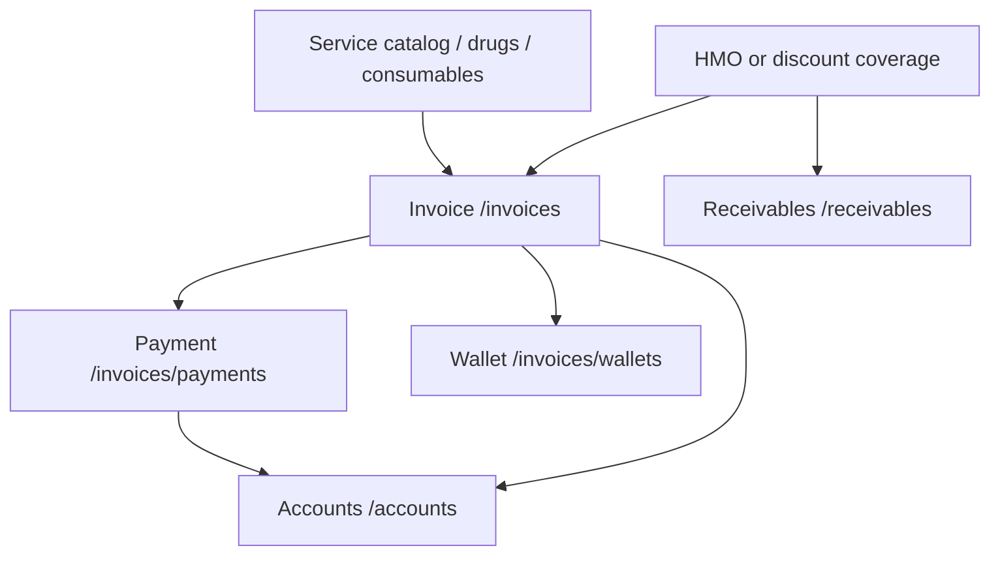

# Finance

Invoices are the bill of record. Payments, wallets, HMO coverages, discount coverages, refunds, and most accounts reports hang off `/invoices` or off `/accounts`, which reads the same activity.

## Billing (`lib/src/billings/`)

Cashier and billing-head UI. There is no service class inside the folder. Screens call `InvoiceService`, `BillingAnalyticsService`, and `AdmissionService`.

| Screen | Role |
|---|---|
| `BillingDashboardScreen` | Period revenue, unpaid, and overdue charts from `/billing/analytics` |
| `PendingBillsScreen` | Invoice worklist |
| `PayBill` | Take a payment. It is a widget, not its own route |
| `SummaryBills` | Bill summary widget |
| `PatientBillingScreen` in `inpatient.bills.dart` | Inpatient charge sheet |
| `InpatientBillsListScreen` | List of inpatient bills |
| `BillingWardInpatientsScreen` | Ward census for billing. Hospital only |
| `AwaitingBillingClearanceScreen` | Admissions blocked until billing clearance |
| `PatientBillingAccountScreen` | One patient’s invoices and payments |

`ChargeItem` (`inpatient_charge_models.dart`) is a line being composed on the charge sheet. `ParkedBillingSession` is the in-memory cart a cashier can set down and restore.

`hmo_coverage_ui.dart` posts coverages through `InvoiceService` (`POST /invoices/{id}/coverages/hmo` and the discount equivalent). `PurchasesConsumableBillingPanel` sells non-drug items onto an invoice. `catalog_sales_widgets.dart` is shared with pharmacy dispense and purchase-item sales.

`InpatientInvoicePdf` renders the inpatient bill. Permissions are `lib/src/auth/billing_permissions.dart`. Privileged staff see the dashboard; billing staff land on the pending list and do not get system setup.

`BillingService` (`/billing`) is the lower-level client beside the analytics service. Day-to-day screens more often go through `InvoiceService`.

## Invoices (`InvoiceService`)

`lib/src/services/invoice_service.dart` is the largest finance client. It covers:

- create, get, list, and update invoices
- paid-without-encounter lookup for the doctor queue
- HMO and discount coverages
- wallet read, deposit, adjustment, and transactions
- refunds
- soft-delete support used with `TransactionService`

Related clients:

| Service | Path | Role |
|---|---|---|
| `InvoicePurchasesApiService` | `/invoice-purchases` | Attach a purchases-inventory item |
| `InvoiceConsumablesApiService` | `/invoice-consumables` | Attach a store consumable |
| `BillingAnalyticsService` | `/billing/analytics` | Dashboard series |

Invoice DTOs are `lib/src/models/invoice.dart` (Freezed) and `invoice_billing_models.dart` (`BillingWallet`, `BillingWalletTransaction`, coverage payloads). `invoice_by_service_category_row.dart` is the revenue-by-category row.

Providers: `invoices_providers.dart`, `billing_providers.dart`, `parked_billing_provider.dart`.

## Payments (`lib/src/transaction/`)

`TransactionsScreen` lists, filters, pays, refunds, and reprints. Widgets in the folder: table, details pane, filter bar, filters panel, summary, change-tender dialog, refund dialog.

`TransactionService`:

| Call | Path |
|---|---|
| List, create, patch, delete | `/invoices/payments` |
| Quick pay | `/invoices/payments/quick` |
| Soft-delete an invoice | `/invoices/soft-delete` |
| Banks for the tender | `GET /banks` |

DTOs `CreateTransactionDto` and `QuickTransactionDto` live on the service. The row model is `TransactionModel` in `lib/src/models/transaction.dart`, with item and payment child types. `TransactionFilter` and `StaffSummaryEntry` support the ledger filters.

`lib/src/ui/transactions/pending_transactions.dart` (`PendingTransactionsScreen`) is an older pending list. The live ledger is `TransactionsScreen`.

Receipt printing is `TransactionReceiptPrinter` and `ReceiptEscposService`. The user picks a network or Windows raw printer from `receipt_printer_picker_sheet.dart`.

## Wallets (`lib/src/wallet/`)

`PatientWalletHistoryScreen` takes `patientUuid`, `patientName`, and `chartNumber`.

| Helper | Role |
|---|---|
| `WalletDepositDialog`, `WalletAdjustDialog` | Write movements |
| `WalletReceiptHelper` | Local receipt |
| `WalletPaymentResolver` | Apply wallet balance to a bill |
| `WalletHistoryQuery` | List filters |
| `wallet_reference_labels.dart` | Human labels for reference types |

The accounts pack has a separate cross-patient view, `AccountsWalletsOverviewScreen`, from `/accounts/wallets/summary`.

## HMO (`lib/src/hmo/`)

Insurer master data and the tariff.

| Screen | Role |
|---|---|
| `HmoListScreen` | Insurers |
| `HmoDetailScreen` | One insurer, including enrolled patients |
| `HmoFormScreen` | Create and edit |
| `HmoServicePricingScreen` | Per-service prices |
| `hmo_tariff_import_sheet.dart` | CSV import. Parser: `hmo_tariff_csv_parser.dart` |

`HmoService`: `/hmos`, `/hmos/{id}/service-prices`, `/hmos/{id}/patients`. Models in `hmo_models.dart`: `HmoListItem`, `HmoDetail`, `HmoServicePriceRow`, `HmoPatientRow`.

`ServiceModel` can also carry `ServiceHmoPrice` from the catalog. Billing applies the chosen price as a coverage on the invoice. The HMO module is enabled for the hospital product and for lab & pharmacy. It is off for the pharmacy-only and diagnostics products unless you change `ProductDefinition`.

## Discount policies (`lib/src/discount_policies/`)

`DiscountPolicyManagementScreen` is CRUD on `/discount-policies` through `DiscountPolicyService`. `InvoiceService` reads the same policies when a cashier applies a discount coverage. Models: `DiscountPolicy`, `DiscountPolicyPayload`.

## Clinical packages (`lib/src/clinical_packages/`)

`ClinicalPackageManagementScreen` edits bundles on `/clinical-packages`. A package item points at a catalog service or a drug. Billing applies the package as a set of invoice lines. Models: `ClinicalPackage`, `ClinicalPackageItem`, `ClinicalPackagePayload`. The route sits in `billingRoutes`.

## Receivables (`lib/src/receivables/`)

What is still owed after a coverage is applied, plus remittances.

| Screen | Role |
|---|---|
| `ReceivablesHmoScreen` | HMO balances. View requires `canViewReceivables` |
| `ReceivablesDiscountScreen` | Discount-sponsor balances. Same file, different kind |
| `ReceivablesAnalyticsScreen` | Collections analytics. Registered on the accounting module |

`ReceivablesService`: `/receivables/hmo`, `/receivables/discount`, statements, `POST /receivables/remittances`, and analytics for HMO coverage, discount coverage, and remittance collections. Models are `receivables_models.dart` (`ReceivableItem` and the remittance payloads). The HMO list filter reuses `HmoService`.

## Accounts (`lib/src/accounts/`)

The accounts and audit pack. `canAccessAccountsModule` allows an accounting account type, the account head, a super admin, or CMD as read-only. Mutations such as bank management and approvals stay with the head.

`AccountsBaseService` shares Dio and the `{ data }` unwrap. Callers:

| Service | Used for |
|---|---|
| `AccountsDashboardService` | Home bundle |
| `AccountsReportsService` | Statements and revenue |
| `AccountsAuditService` | Audit, compliance, leaks, staff activity, approvals |
| `AccountsRefundRequestsService` | Refund queue and history |

Paths are constants in `accounts_endpoints.dart` under `/accounts/...`. Providers and the period filter live in `accounts_providers.dart`. Models are `accounts_models.dart` (`AccountsDashboardBundle` and the report, journal, chart-of-accounts, refund, and reconciliation rows).

### Screens by job

**Home.** `AccountsDashboardScreen`.

**Revenue.** `AccountsRevenueSummaryScreen`, `AccountsRevenueByServiceScreen`, `AccountsRevenueByServiceDetailScreen`, `AccountsDailyCollectionsScreen`, `AccountsPaymentMixScreen`, `AccountsPeriodComparisonScreen`.

Revenue by service is routed with billing (`AppModule.billing`) so a diagnostics product can open it. The screen class still lives in `accounts/`.

**Statements.** `AccountsFinancialReportsHubScreen`, `AccountsProfitLossScreen`, `AccountsCashFlowScreen`, `AccountsAgingReportScreen`, `AccountsExpenseVsBudgetScreen`, `AccountsCollectionEfficiencyScreen`.

**Control.** `AccountsAuditLogScreen`, `AccountsComplianceScreen`, `AccountsInvoiceChangesScreen`, `AccountsLeakDetectionScreen`, `AccountsStaffActivityScreen`, `AccountsApprovalsScreen`, `AccountsRefundRequestsScreen`, `AccountsRefundHistoryScreen`.

Refund requests are routed with billing. Refund history stays on accounting.

**Cash.** `AccountsWalletsOverviewScreen`, `AccountsDailyCashReconScreen`, `AccountsBankReconScreen`, `AccountsBanksScreen`.

The accounts banks screen is the read-oriented ledger view. Creating banks is `BankManagementScreen` in `lib/src/ui/system_setup/`, which uses `BankService` on `/banks` and is registered with billing.

**Ledger.** `AccountsJournalEntriesScreen`, `AccountsChartOfAccountsScreen`, `AccountsPeriodCloseScreen`.

Widgets in the folder (`accounts_async_scaffold.dart`, `accounts_data_table_box.dart`, `accounts_section_header.dart`, `accounts_access_denied.dart`) are the local chrome. New accounts pages should use them so the pack stays consistent. `accounts_breakpoints.dart` is the older breakpoint helper; new layout code uses `AppBreakpoints`.

## Catalog that billing sells (`lib/src/hospital_service/` and `lib/src/ui/patinets_services/`)

Departments, categories, services, and wards are the price list.

| Screen | Client |
|---|---|
| `SystemSetupScreen` | Tabs for departments, categories, and services |
| `WardManagementScreen` | Wards and beds |
| `AddDepartmentScreen`, `AddCategoryScreen`, `AddServiceScreen`, `ViewServiceScreen`, `RenderServiceScreen`, `EnlistServiceScreen` | The earlier catalog screens. They call the same services |

`DepartmentService` → `/departments`. `ServiceCategoryService` → `/service-categories`. `ServiceService` → `/services`. `WardService` → `/wards` and `/beds`. Who may edit them is `hospital_service_permissions.dart`.

`ConsultingRoomsScreen` maintains rooms used when a patient is checked in. It is registered with the billing routes.

## Announcements on the billing route list

`AnnouncementManagementScreen` is registered inside `billingRoutes` and mapped to `AppModule.administration`. Behavior of the banner is in [Leadership and platform](13-leadership-and-platform.md).
