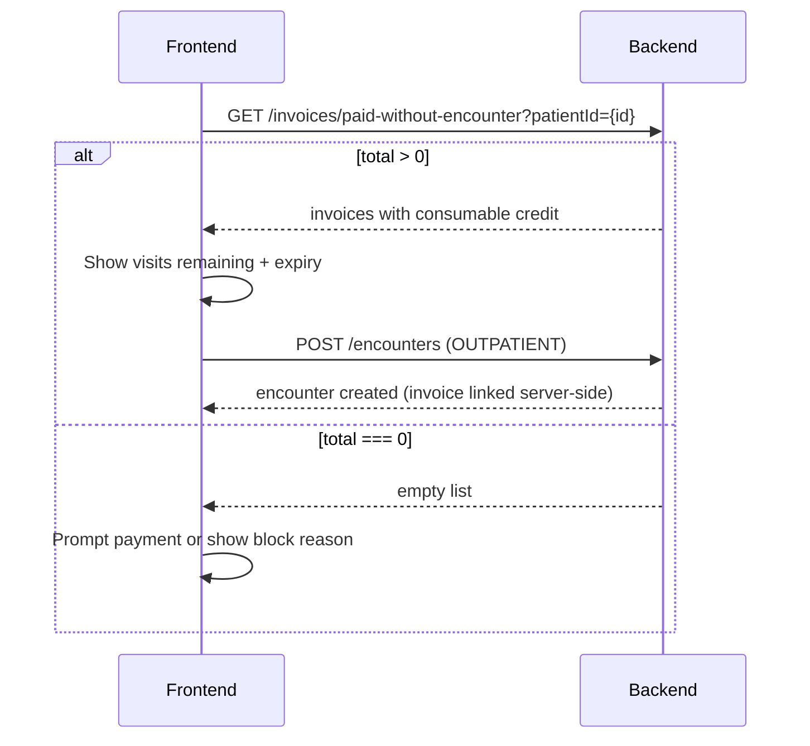

# Consultation Credit — Frontend Guide

This document describes how paid **consultation credit** works in the API and how the frontend should use the relevant endpoints when checking whether a patient can start OPD or appear in the waiting-room queue.

## Business rules

Each paid consultation line on an invoice grants:

| Rule | Value |
|------|-------|
| Visits per payment | **2** (`CONSULTATION_CREDIT_MAX_VISITS`) |
| Validity after payment | **14 days** (`CONSULTATION_CREDIT_VALIDITY_DAYS`) |
| Service category | `Consultations & Reviews` |

After payment, the backend stamps `consultationCreditExpiresAt` on consultation line items. Each completed OPD encounter consumes one visit. When visit 1 finishes and visit 2 is still available, the invoice’s `encounterId` is cleared so the credit can be selected again for a return visit (within the 14-day window).

A credit is **consumable** when all of the following are true:

- Invoice `status` is `PAID`
- Invoice `encounterId` is `null` (no consultation currently in progress on that invoice)
- Line `settled` is `false`
- `consultationVisitsConsumed` &lt; 2
- `consultationCreditExpiresAt` is set and is in the future

Starting OPD (`POST /encounters` with `encounterType: OUTPATIENT`) uses the backend’s FIFO picker (`findFirstConsumableConsultationItem`). The frontend does **not** need to pass an invoice id; it only needs to confirm credit exists or show a helpful message when it does not.

---

## Endpoints

### 1. Patient lookup — consumable credits only

**`GET /invoices/paid-without-encounter?patientId={uuid}`**

Use this when you already have a patient selected (e.g. before starting OPD, on the patient chart, or in a “does this patient have a valid consultation payment?” check).

**Query parameters**

| Param | Required | Description |
|-------|----------|-------------|
| `patientId` | **Yes** (for this mode) | Patient primary key UUID (`Patient.id`, same as `Invoice.patientId`) |
| `allowIP` | No | Default `false`. When `true`, include admitted inpatients (`Patient.status = ADMITED`). Otherwise outpatient only. |
| `skip` | No | Pagination offset (default `0`) |
| `take` | No | Page size (default `20`) |
| `fromDate` / `toDate` | Ignored | **Ignored when `patientId` is set.** Date range does not apply in patient mode. |

**Behavior**

Returns only that patient’s **PAID** invoices that still have **consumable** consultation credit (visits remaining, not expired, no active encounter hold). Results are ordered **oldest first** (`updatedAt asc`) — same FIFO order the backend uses when starting OPD.

**Response shape** — same as `GET /invoices`:

```json
{
  "invoices": [ /* Invoice[] */ ],
  "total": 1,
  "skip": 0,
  "take": 20
}
```

Each invoice includes nested `patient`, `invoiceItems`, `staff`, `consultingRoom`, `vitals`, etc. (same include as the main invoice list).

**Consultation fields on each `invoiceItem`**

| Field | Type | Meaning |
|-------|------|---------|
| `consultationVisitsConsumed` | number | Visits already used (0 or 1 typically while credit is active) |
| `consultationCreditExpiresAt` | ISO datetime \| null | Expiry (14 days after payment) |
| `settled` | boolean | `true` when both visits are used |

**Derive UI values client-side:**

```ts
const MAX_VISITS = 2;

const visitsRemaining = Math.max(
  0,
  MAX_VISITS - (item.consultationVisitsConsumed ?? 0),
);

const expired =
  item.consultationCreditExpiresAt != null &&
  new Date(item.consultationCreditExpiresAt) <= new Date();

const consumable =
  invoice.encounterId == null &&
  !item.settled &&
  visitsRemaining > 0 &&
  !expired;
```

**Empty result (`total === 0`)**

The patient has no consumable consultation credit. Do not treat this as an error by itself — show the appropriate empty state and rely on OPD start error text if the user tries to proceed (see [OPD start errors](#opd-start-errors) below).

**Example request**

```
GET /invoices/paid-without-encounter?patientId=550e8400-e29b-41d4-a716-446655440000
```

---

### 2. Waiting-room queue — all ready patients (no patient filter)

**`GET /invoices/paid-without-encounter`**

Use this for the **front-desk / waiting-room list** when you are **not** scoped to one patient.

**Query parameters**

| Param | Required | Description |
|-------|----------|-------------|
| `fromDate` / `toDate` | No | Default **today** if omitted. Filters by invoice `updatedAt` for non–consultation-credit rows. |
| `allowIP` | No | Same as above |
| `skip` / `take` | No | Pagination |

**Behavior**

Returns PAID invoices with `encounterId: null` that are ready for encounter start:

1. **Always included:** invoices with consumable consultation credit (even if `updatedAt` is outside the date range — so **return visits** within 14 days still appear in today’s queue).
2. **Also included when `updatedAt` is in range:** other paid bills without an encounter (e.g. lab-only) that are not dead consultation-only credit.

Consultation-only invoices whose credit is **expired or fully used** are omitted.

Results are ordered **newest first** (`updatedAt desc`).

Do **not** use this endpoint with `patientId` when you only care about that one patient’s credits — use the patient mode in section 1 instead.

---

### 3. Full credit history (including expired / exhausted)

**`GET /patients/:id/consultation-credits`**

Use this for a **patient chart** or admin view where you need every consultation payment line, not only consumable ones.

**Response**

```json
{
  "credits": [
    {
      "invoiceItemId": "uuid",
      "invoiceId": "uuid",
      "invoiceID": "A1B2C3D4E5",
      "serviceId": "uuid",
      "serviceName": "General Consultation",
      "visitsConsumed": 1,
      "visitsRemaining": 1,
      "expiresAt": "2026-07-04T12:00:00.000Z",
      "expired": false,
      "settled": false,
      "consumable": true
    }
  ]
}
```

| Endpoint | Scope | Includes expired / used | Best for |
|----------|--------|---------------------------|----------|
| `GET /invoices/paid-without-encounter?patientId=` | One patient | No — consumable only | Pre–OPD check, “can start consultation?” |
| `GET /invoices/paid-without-encounter` | All patients | No for dead consultation credit | Waiting-room queue |
| `GET /patients/:id/consultation-credits` | One patient | Yes | Patient chart / billing history |

---

## Recommended UI flows

### Before starting OPD



1. Call `GET /invoices/paid-without-encounter?patientId={Patient.id}`.
2. If `total > 0`, show e.g. “Consultation credit: visit 2 of 2, expires 4 Jul 2026” from the first invoice’s consultation line (FIFO — first result is the one OPD start will use).
3. On **Start OPD**, call `POST /encounters` as usual. Do not send `invoiceId`; the backend binds credit automatically.

### Waiting-room board

1. Call `GET /invoices/paid-without-encounter` with today’s `fromDate` / `toDate` (or omit for default today).
2. Render patient name, invoice ID, consulting room, vitals, etc. from the invoice payload.
3. For consultation rows, read `consultationVisitsConsumed` and `consultationCreditExpiresAt` from matching line items to show return-visit status.

### Patient chart — billing tab

Use `GET /patients/:id/consultation-credits` to list all consultation payments with `visitsRemaining`, `expired`, and `consumable` flags.

---

## OPD start errors

If `POST /encounters` fails with `400 Bad Request`, the message is one of:

| Message | Meaning |
|---------|---------|
| `No paid consultation invoice is on file for this patient.` | No consultation payment found |
| `A consultation is already in progress for this patient.` | An invoice still has `encounterId` set |
| `The consultation payment has expired (valid for 14 days after payment).` | All credits expired |
| `The consultation payment has already been used for the maximum number of visits (2).` | All credits exhausted |
| `No paid consultation credit is currently available for this patient.` | Fallback |

Map these to your payment / front-desk flows as needed.

---

## Migration note for existing frontend code

If you previously called `GET /invoices/paid-without-encounter?patientId=` expecting **any** paid invoice without an encounter (including lab-only bills in the date window), that behavior has changed.

**With `patientId`:** the API now returns **only invoices with consumable consultation credit**, regardless of date range. Use `GET /invoices?patientId=` or another invoice list endpoint if you still need non-consultation paid bills for a patient.

**Without `patientId`:** waiting-room behavior is unchanged (date range + reusable consultation credit OR logic).
