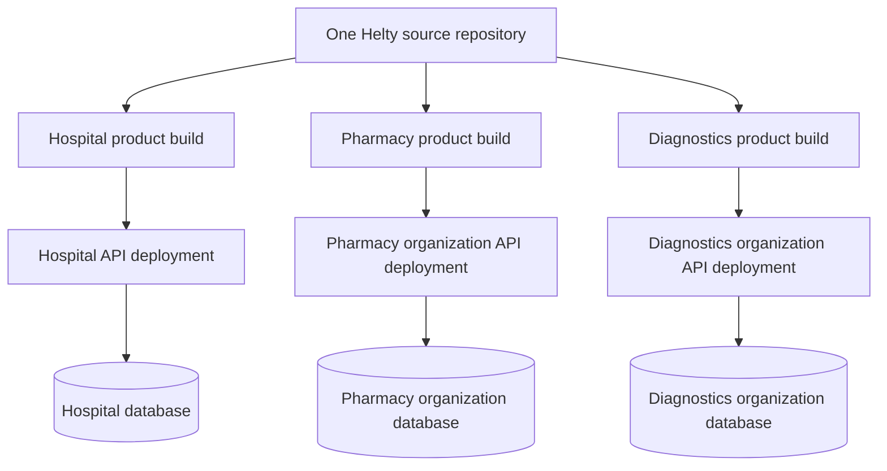

# Helty Product-Line Extraction Plan

## Purpose

Helty currently serves a full hospital. The goal is to reuse its mature modules for independent organizations without rebuilding them:

- **Helty Hospital** — the existing full application
- **Helty Pharmacy** — patient registration, billing, and pharmacy
- **Helty Diagnostics** — patient registration, billing, laboratory, and radiology
- Future products assembled from the same shared capabilities

These organizations are operationally and legally separate. Their users, patients, transactions, inventory, and clinical records must never be mixed.

---

## Recommended approach

Use a **single source repository with multiple product builds**, backed initially by a **separate API deployment and database for each organization**.

Do not maintain permanent stripped-down forks. A temporary fork can deliver a first customer quickly, but every bug fix, API change, and security update would then need to be copied manually into every fork.

The recommended model is:



This keeps the current hospital product intact while allowing each external organization to receive a smaller, branded application containing only its required modules.

---

## Why this is the best initial option

### Benefits

1. **One maintained codebase**
   - Fixes to registration, billing, authentication, and shared UI reach every product.
   - Product-specific changes remain isolated through configuration.

2. **No full multi-tenant backend rewrite initially**
   - The same backend code can be deployed once per organization.
   - Each deployment uses its own database, secrets, storage, and API hostname.

3. **Strong data isolation**
   - A query missing an organization filter cannot accidentally return another organization's patients because the organizations do not share a database.
   - Backups, restores, retention, and data exports can be managed independently.

4. **The hospital application remains the default**
   - Existing behavior is preserved when no product is specified.
   - Product extraction can happen incrementally.

5. **Future flexibility**
   - If operating many small organizations later makes separate deployments expensive, the backend can be deliberately converted to multi-tenancy.
   - That decision does not need to delay the first external product.

### Why permanent forks are not recommended

A permanent `helty-pharmacy` fork and `helty-diagnostics` fork would quickly diverge:

- Billing fixes must be copied to every repository.
- Database and API changes must be coordinated across branches.
- Security fixes can be missed.
- Features implemented for one customer become difficult to reuse.
- Generated routing files and shared models will drift.

Use product configuration to remove features from a build, not source deletion as the long-term architecture.

---

## Product composition

Every product is assembled from a shared platform and one or more operational modules.

### Shared platform

All products normally require:

- Authentication and session management
- Staff accounts, roles, and permissions
- Patient registration, search, and selection
- Service catalog and pricing
- Invoice creation and payment
- Receipts and relevant printing
- Shared errors, networking, responsive layout, and navigation shell
- Organization-specific branding and API configuration

### Hospital product

The existing hospital build remains the complete application and includes all current modules.

### Pharmacy product

Include:

- Shared platform
- Patient registration and search
- Billing and payment
- Pharmacy inventory
- Suppliers and stock intake
- Stock transfer and requisitions
- Medicine sales and dispensing
- Dispense history
- Pharmacy reports required by the organization

Exclude hospital-only modules such as doctor encounters, nursing, wards, emergency, theatre, obstetrics, dialysis, laboratory, and radiology unless explicitly purchased.

### Diagnostics product

Include:

- Shared platform
- Patient registration and search
- Billing and payment
- Laboratory orders and results
- Radiology requests and results
- Relevant reports and printing

Exclude pharmacy and other hospital-only modules unless explicitly purchased.

---

## Frontend design

### 1. Introduce a product definition

Add a central product model rather than scattering checks for product names throughout the application.

Suggested shape:

```dart
enum AppProduct {
  hospital,
  pharmacy,
  diagnostics,
}

enum AppModule {
  registration,
  billing,
  pharmacy,
  laboratory,
  radiology,
}

class ProductDefinition {
  const ProductDefinition({
    required this.product,
    required this.displayName,
    required this.enabledModules,
  });

  final AppProduct product;
  final String displayName;
  final Set<AppModule> enabledModules;
}
```

The hospital definition must be the default so existing development and production commands continue to behave as before.

### 2. Select the product at compile time

Use a compile-time value:

```bash
flutter build windows --dart-define=APP_PRODUCT=hospital
flutter build windows --dart-define=APP_PRODUCT=pharmacy
flutter build windows --dart-define=APP_PRODUCT=diagnostics
```

Do not rely only on a hidden menu. A product build should register only its supported routes and workflows where practical.

### 3. Add product-specific entry points

Recommended structure:

```text
lib/
  main.dart
  main_pharmacy.dart
  main_diagnostics.dart
  src/
    app/
      product_definition.dart
      product_environment.dart
```

Keep shared startup logic in one reusable bootstrap function. Entry points should supply configuration rather than duplicate `main.dart`.

### 4. Make the API URL configurable

The current API service contains hard-coded candidate URLs. Replace production selection with compile-time configuration while retaining local development fallbacks if needed:

```bash
--dart-define=API_BASE_URL=https://api.customer.example
```

Requirements:

- Production builds must have one explicit HTTPS API URL.
- Do not probe unrelated production servers.
- Do not commit customer secrets.
- Validate that the configured URL is present for release builds.
- Keep access tokens in secure storage as currently intended.

### 5. Filter menus and initial routes

Menu visibility must satisfy both conditions:

1. The module is enabled for the product.
2. The authenticated staff member has permission to use it.

In other words:

```text
visible = product enables module AND user has permission
```

Apply this to:

- `lib/src/ui/home/account_types.dart`
- `lib/src/ui/home/home_screen.dart`
- `lib/src/routing/initial_route_for_role.dart`

Product configuration is not authorization. The backend must still reject unauthorized requests.

### 6. Split route registration

The generated router currently references the full application. Gradually separate route groups:

```text
lib/src/routing/
  shared_routes.dart
  hospital_routes.dart
  pharmacy_routes.dart
  diagnostics_routes.dart
```

Desired composition:

- Hospital router = shared + all hospital module routes
- Pharmacy router = shared + pharmacy routes
- Diagnostics router = shared + lab + radiology routes

The exact implementation must follow the capabilities of the installed `auto_route` version. Avoid hand-editing generated `.gr.dart` files.

### 7. Add product branding

Each product or customer deployment may require:

- Application display name
- Logo and launcher icon
- Windows MSIX identity
- Android application ID
- iOS bundle identifier
- Update feed
- Support contact information
- Receipt and report headers

Keep product type separate from customer branding. For example, two pharmacy organizations can use the same pharmacy product with different branding and API URLs.

---

## Backend decision

### Does the backend need to change?

**The backend business features may not need to be rewritten**, provided the existing API already supports:

- Patient registration and search
- Authentication and staff roles
- Service catalog and pricing
- Invoices and payments
- Pharmacy, laboratory, and radiology workflows

However, backend deployment and configuration **must** change for unrelated organizations. Sharing the hospital's current API and database without tenant isolation would expose serious privacy, security, and financial risks.

### Recommended initial backend model: isolated deployment per organization

Reuse the backend source code, but give every organization:

- A separate API deployment or isolated runtime
- A separate database
- Separate database credentials
- Separate token/signing secrets
- Separate file/object storage namespace or bucket
- Separate administrator accounts
- Separate backups
- Separate logs and monitoring access
- A separate API hostname

Example:

```text
Hospital:
  app: helty-hospital
  API: api.hospital.example
  DB:  helty_hospital

Pharmacy A:
  app: helty-pharmacy
  API: api.pharmacy-a.example
  DB:  helty_pharmacy_a

Diagnostics B:
  app: helty-diagnostics
  API: api.diagnostics-b.example
  DB:  helty_diagnostics_b
```

The same backend release can be deployed to all organizations, but migrations must be run and verified separately for each database.

### Backend items that still require verification

Before onboarding an external organization, verify:

- Hospital-specific seed data is not automatically inserted.
- Required roles can be created without hospital-only roles.
- The service catalog starts empty or from an organization-appropriate template.
- Invoice and receipt numbering cannot collide within an organization.
- Patient identifiers are generated independently per organization.
- Reports do not contain hard-coded hospital names.
- Uploaded files are stored separately.
- Email, SMS, payment gateway, and printer settings are organization-specific.
- Desktop update feeds cannot distribute the wrong product.
- Logs do not leak sensitive data across customers.
- Deleting or restoring one organization cannot affect another.

### When multi-tenancy may be appropriate later

A shared API and database can be considered when the number of organizations makes isolated deployments too expensive to operate. This is a separate backend project, not just a frontend flag.

A safe multi-tenant design requires:

- An immutable `organizationId` or `tenantId` on every organization-owned record
- Tenant identity derived from the authenticated token, not trusted from request bodies
- Tenant-scoped uniqueness constraints and indexes
- Tenant filtering in every query, update, delete, aggregate, report, and background job
- Tenant-aware file storage and cache keys
- Tests proving cross-tenant reads and writes are impossible
- Tenant-aware audit logs, exports, backups, and support tooling
- A deliberate migration plan for existing hospital data

Until those controls exist and have been security-reviewed, unrelated organizations must not share one database.

---

## Authorization and licensing

Feature visibility in Flutter is not a security boundary. An attacker can call API endpoints directly.

The backend must enforce:

- The staff member belongs to the correct deployment or organization.
- The staff role permits the requested operation.
- Hospital-only endpoints are unavailable or forbidden where inappropriate.
- Sensitive financial operations require appropriate billing permissions.
- Clinical results and patient records follow least-privilege access.

If product licensing is required later, store allowed modules in trusted server-side organization configuration. The frontend may use that configuration for presentation, but the backend remains authoritative.

---

## Recommended implementation phases

### Phase 0 — Confirm scope

- Choose the first external product: pharmacy or diagnostics.
- List its required screens, roles, reports, and workflows.
- Confirm whether each organization receives its own branding.
- Confirm that each organization will have an isolated backend deployment and database.

### Phase 1 — Product configuration without removing code

- Add `AppProduct`, `AppModule`, and product definitions.
- Keep hospital as the default product.
- Add compile-time product and API URL configuration.
- Filter menus and landing routes.
- Add product-specific branding.
- Build all products in CI.

Exit criteria:

- Existing hospital behavior remains unchanged.
- Pharmacy or diagnostics users see only appropriate menus.
- Every build points to the intended API.

### Phase 2 — Product-specific routing

- Separate shared and product route groups.
- Remove hospital-only routes from smaller product builds.
- Regenerate routes.
- Add navigation tests for each product.

Exit criteria:

- Disabled module routes cannot be opened in a smaller product.
- Deep links cannot bypass product restrictions.

### Phase 3 — Backend deployment template

- Containerize or standardize deployment if not already done.
- Parameterize database URL, signing secrets, storage, branding, and integrations.
- Create repeatable migration and seed procedures.
- Create backup and restore procedures.
- Create one isolated environment for the first external organization.

Exit criteria:

- The customer environment contains no hospital data.
- Credentials and storage are isolated.
- A restore test succeeds.

### Phase 4 — Extract shared packages only when useful

Do not begin with a large package migration. Once product builds are stable, extract code where boundaries are clear:

```text
packages/
  helty_core/
  helty_registration/
  helty_billing/
  helty_pharmacy/
  helty_laboratory/
  helty_radiology/

apps/
  helty_hospital/
  helty_pharmacy/
  helty_diagnostics/
```

This is valuable when independent teams or release schedules justify the additional package and dependency management.

---

## Testing requirements

For every product:

### Build tests

- Hospital build succeeds.
- Pharmacy build succeeds.
- Diagnostics build succeeds.
- Generated routing files are current.

### Product-boundary tests

- Pharmacy contains no lab, radiology, nursing, or doctor menu.
- Diagnostics contains no pharmacy, nursing, or doctor menu.
- Hospital retains all currently authorized modules.
- Disabled routes cannot be reached directly.

### Workflow tests

- Register a patient.
- Search and select the patient.
- Create an invoice.
- Record full and partial payments.
- Print a receipt.
- Continue into the correct post-payment module flow.
- Confirm role restrictions for ordinary staff and heads.

### Isolation tests

- Customer environments use different databases.
- Tokens from one deployment are rejected by another.
- Files uploaded in one environment are unavailable in another.
- Backups and restores affect only the intended organization.
- Logs and reports contain only that organization's data.

---

## Release and operations checklist

For each organization:

- [ ] Product type selected
- [ ] Required modules approved
- [ ] App name, logo, and identifiers configured
- [ ] HTTPS API URL configured
- [ ] Separate database created
- [ ] Separate API secrets created
- [ ] Separate file storage configured
- [ ] Roles and first administrator seeded
- [ ] Service catalog and prices configured
- [ ] Receipt/report identity configured
- [ ] Payment, email, and SMS integrations configured if used
- [ ] Database migrations completed
- [ ] Backup and restore tested
- [ ] Product-boundary tests passed
- [ ] Organization-isolation tests passed
- [ ] Correct desktop/mobile update channel configured
- [ ] Monitoring and support ownership assigned

---

## Decisions to preserve

1. The existing hospital application remains the default and must not regress.
2. External products reuse code; they are not rebuilt from scratch.
3. One source repository is preferred over permanent forks.
4. Product configuration controls composition and presentation.
5. Roles and backend authorization control access.
6. Each unrelated organization initially receives a separate API deployment and database.
7. Multi-tenancy is postponed until it is operationally necessary and can be implemented comprehensively.
8. Shared package extraction happens incrementally after product boundaries are proven.

---

## Immediate next step

Start with one external customer and implement **Phase 1**:

1. Add product definitions with hospital as the default.
2. Add an explicit `API_BASE_URL` build value.
3. Create the first pharmacy or diagnostics entry point.
4. Filter menus and initial routes by enabled modules and staff permissions.
5. Build and test the existing hospital product before making route-level reductions.

Do not delete existing module folders during this phase. The first objective is a safe product boundary with minimal risk to the hospital application.
